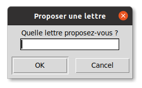

# Vers la boucle principale du jeu

## Rappel des épisodes précédents

* Programme à télécharger.
* Rappel des notions.
* Introduction à l'éditeur

## Interaction avec le joueur

Pour demander une lettre  on utilise `feuille.textinput(titre,question)` qui crée une fenêtre dans laquelle l'utilisateur peut taper sa réponse. Les paramètres `titre` et `question` permettent de spécifier le titre de cette fenêtre et d'écrire le texte de la question.
Par exemple :

```python
lettre=feuille.textinput("Proposer une lettre","Quelle lettre proposez-vous ?")
```
 affichera :
{.imgcentre}

## Boucle non bornée

La boucle `for`, déjà rencontrée permet de répéter des instructions un nombre **déterminé** de fois, on parle dans ce cas, de **boucles bornées**. La situation ici est différente, on ne connaît pas le nombre d'erreurs que va commettre le joueur avant de découvrir le mot. On utilise une **boucle non bornée** en spécifiant sa condition d'arrêt, en français cela donne : *tant que* le nombre d'erreurs possibles (limité à 6), n'est pas atteint répéter la demande d'une lettre. Ou encore en Python:

```python
nb_erreurs = 0
while nb_erreurs<7:
    lettre=feuille.textinput("Proposer une lettre","Quelle lettre proposez-vous ?")
```

Inclure ces lignes dans le programme du pendu et constater que la boucle est pour le moment infinie puisque la variable `nb_erreurs` reste à 0. 

## Instruction conditionnelle

Il faut donc modifier `nb_erreurs` en fonction de la réponse du joueur : si la lettre ne fait pas partie du mot, alors on incrémente le nombre d'erreurs :
```python
nb_erreurs = 0
while nb_erreurs<7:
    lettre=feuille.textinput("Proposer une lettre","Quelle lettre proposez-vous ?")
    if lettre not in MOT:
        nb_erreurs+=1
```
Remplacer la boucle précédente par celle-ci dans le programme du pendu, et vérifier qu'à présent la boucle se termine après 7 erreurs.

## Dessin du pendu correspondant au nombre d'erreurs

Compléter la boucle `while` en y écrivant une instruction conditionnelle permettant de tracer le début du pendu (en appelant la fonction `pendu_1()`) lorsque la première erreur est commise.